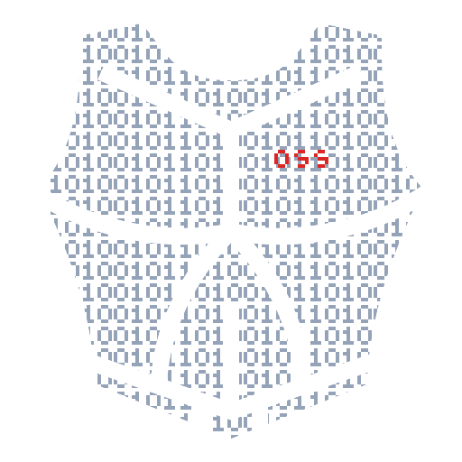

<!-- ossplate:readme-identity:start -->
# Ossplate

Build one project, ship it everywhere.
<!-- ossplate:readme-identity:end -->



`ossplate` helps you start and maintain a project that ships the same CLI through Rust, npm, and PyPI.

It gives you a working baseline with:

- one real core CLI
- thin JavaScript and Python wrappers
- release-ready workflows for Cargo, npm, and PyPI
- a scaffold you can create, adopt, and keep in sync

## What It Does

Use `ossplate` when you want a single command-line tool to exist cleanly in multiple ecosystems without maintaining three separate implementations.

It can:

- create a new scaffolded project
- initialize an existing directory with the expected structure
- validate project identity and metadata
- synchronize the files it owns

## Quick Start

```bash
cargo run --manifest-path core-rs/Cargo.toml -- create ../my-new-project \
  --name "My Project" \
  --repository "https://github.com/acme/my-project" \
  --author-name "Acme" \
  --author-email "oss@acme.dev" \
  --rust-crate "my-project" \
  --npm-package "@acme/my-project" \
  --python-package "my-project-py" \
  --command "my-project"
```

Then check that everything is aligned:

```bash
cargo run --manifest-path core-rs/Cargo.toml -- validate
cargo run --manifest-path core-rs/Cargo.toml -- sync --check
```

## Core Commands

```bash
ossplate version
ossplate create <target>
ossplate init --path <dir>
ossplate validate
ossplate sync --check
```

The same command surface is available through the Rust binary and the packaged JS/Python wrappers.

## Why It’s Useful

- You keep one source of truth for CLI behavior.
- You avoid drift between Rust, npm, and PyPI releases.
- You get a real scaffold instead of a fake demo project.
- You can publish with modern registry workflows instead of assembling release plumbing from scratch.

## Learn More

- [Documentation](./docs/README.md)
- [Testing Guide](./docs/testing.md)
- [Release Guide](./docs/releases.md)
- [Architecture](./docs/architecture.md)

## License

Licensed under the [Unlicense](LICENSE).
